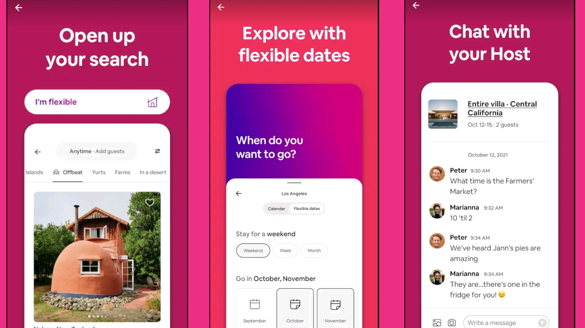

# Awesome Project Ideas

Do you want to learn web development, but just **don't know what to create?**
This list was designed for you then!

These ideas are great for:
- Displaying in your **portfolio**!
- Learn a new **JS Framework**!
- Practicing your **Webdev Skills**!

Each idea has the following features:
1. **Screenshots** of the idea.
2. **Details** that explain what should be implemented.
3. **Inspiration** resources that can help guide you.
4. **Hints** that you can use if you're stuck.
5. **Tutorials** as a last-resort in case you're stuck.

The ideas are split into 3 groups:

| Level | Requirements |
| --- | --- |
| Beginner | Know the basics of HTML, CSS, and JS. |
| Intermediate | Proficient in [web fundamentals](https://developer.mozilla.org/en-US/docs/Learn) |

## 👶️ Beginner

### 1. Simple Calculator

What better way to start off this list than the classic example: a calculator!

####  Details
 user can enter decimals.  
 user can enter operators.  
 user can see result.  
 app saves history of math expressions.

####  Inspiration
 [Samsung Calculator](https://play.google.com/store/apps/details?id=com.sec.android.app.popupcalculator)  
 [Google Calculator](https://play.google.com/store/apps/details?id=com.google.android.calculator)  
 [Xiaomi Calculator](https://play.google.com/store/apps/details?id=com.miui.calculator)  

####  Hints for Javascript
 use [`eval()`](https://www.w3schools.com/jsref/jsref_eval.asp) to calculate.

####  Tutorials for React
 [Tyler Potts | 21K views | 7 months ago](https://youtu.be/oiX-6Y2oGjI)  
  
 [Web Dev Simplified | 73K views | 3 months ago](https://youtu.be/DgRrrOt0Vr8)  
  
 [Digital Solutions Master | 30K views | 10 months ago](https://youtu.be/hpfDRnijdPE)  

### 2. Tic Tac Toe

We all know Tic Tac Toe...

####  Details
 user can play offline by switching between 2 players.  
 user can choose a difficulty level.  
 user can choose a board size.  
 user can unlock achievements.   

####  Inspiration
 [Google's Tic Tac Toe](https://www.google.com/search?q=tic+tac+toe&oq=tic+tac+toe)  
 [Classic Tic Tac Toe](https://playtictactoe.org/)

####  Hints for Javascript
 efficient algorithm for [detecting the winner](https://stackoverflow.com/questions/16571035/javascript-tictactoe-if-winner-detection)

####  Tutorials for React
 [codeSTACKr | 31K views | 1 year ago](https://youtu.be/08r9mDQvXpU)  
  
 [Learn Code By Doing | 4.7K views | 10 months ago](https://youtu.be/mM-Se5TEmX8)  
  
 [Coding with Basir | 35K views | 2 years ago](https://youtu.be/it54tShOsuI)  
  

### 3. Countdown Timer

Create an app that counts down the hours, minutes, and seconds.

####  Details
 user can enter an amount of time in hours, minutes, and seconds.  
 user can visually see how much time is left.  
 user can pause and reset the timer.  

####  Inspiration
 [Simple Timer (codepen)](https://codepen.io/karlo-stekovic/pen/OajKVK)  
 [Stopwatch Timer App](https://play.google.com/store/apps/details?id=stopwatch.timer.app)

####  Hints for Javascript
 Use [`setInterval`](https://developer.mozilla.org/en-US/docs/Web/API/WindowOrWorkerGlobalScope/setInterval) and [`clearInterval`](https://developer.mozilla.org/en-US/docs/Web/API/WindowOrWorkerGlobalScope/clearInterval) to create and reset the timer.  

####  Tutorials for React
 [Code Boost | 9.8K views | 1 year ago](https://youtu.be/sSWGdj8a5Fs)  
  
 [Coding with Elias | 19K views | 2 years ago](https://youtu.be/qwKh4pH7KAk)  
  
 [Uzoanya Dominic | 24K views | 1 year ago](https://youtu.be/ZVOGPvo08zM)  
  

### 4. Notes

Write down what's on your mind!

####  Details
 user can create Markdown notes.  
 user can star notes.  
 user can reorder, edit and delete notes.  

####  Inspiration
 [Markdown Notes with React](https://github.com/email2vimalraj/notes-app)  
 [Notes App Android](https://play.google.com/store/apps/details?id=com.eco.note)  
 
####  Hints for Javascript
 Use [Marked](https://github.com/markedjs/marked) to transform Markdown to HTML.  
 Use [`localStorage`](https://developer.mozilla.org/en-US/docs/Web/API/Window/localStorage) to save notes.  

####  Tutorials for React
 [Chris Blakely | 22K views | 9 months ago](https://youtu.be/8KB3DHI-QbM)  
  
 [James Grimshaw | 12K views | 1 year ago](https://youtu.be/ulOKYl5sHGk)  
  
 [Dennis Ivy | 43K views | 5 months ago](https://youtu.be/tYKRAXIio28)  
  

### 5. Pomodoro Timer

Efficiently manage your time using the Pomodoro!

####  Details
 user can start, pause, and stop work periods (25 minutes)  
 user can start, pause, and stop short breaks (5-10 minutes)  
 user can start, pause, and stop long breaks (20-30 minutes)  
 app keeps history of work, short breaks, and long breaks.  

####  Inspiration
 [Online Pomodoro Timer](https://en.m.wikipedia.org/wiki/Pomodoro_Technique)  
 [Pomodoro Android App](https://play.google.com/store/apps/details?id=com.pomodrone.app)  
 
####  Hints for Javascript
 Learn more about the [pomodoro technique](https://en.wikipedia.org/wiki/Pomodoro_Technique)  
 Use [`localStorage`](https://developer.mozilla.org/en-US/docs/Web/API/Window/localStorage) to save notes.  
 Use [`setInterval`](https://developer.mozilla.org/en-US/docs/Web/API/WindowOrWorkerGlobalScope/setInterval) and [`clearInterval`](https://developer.mozilla.org/en-US/docs/Web/API/WindowOrWorkerGlobalScope/clearInterval) to create and reset the timer.  

####  Tutorials for React
 [Coding With Dawid | 4.6K views | 6 months ago](https://youtu.be/B1tjrnX160k)  
  
 [Siphiwo Julayi | 7.7K views | 1 year ago](https://youtu.be/0PnSEPm2UKY)  
  
 [Siphiwo Julayi | 7.7K views | 1 year ago](https://youtu.be/9z1qBcFwdXg)  
  

## 💪️ Intermediate

### 1. Airbnb Clone

Airbnb has very beatiful UI... Let's recreate it!

####  Details
 create an app whose UI is similar to that of Airbnb.

####  Inspiration
 [The Airbnb Design Blog](https://medium.com/airbnb-design)  
 [Airbnb Android App](https://play.google.com/store/apps/details?id=com.airbnb.android)  
 [Airbnb iOS App](https://abnb.me/EVmg/xw6tvraTDs)

####  Hints for React
 Use [Material UI](https://mui.com/) to build the UI.

####  Tutorials for React
 [Clever Programmer | 169K views | 1 year ago](https://youtu.be/BtJeH_-XYaA)  
  
 [notJust.dev | 28K views | 1 year ago](https://youtu.be/ch2oOdnLkqw)  
  
 [Shloka Tech | 4.4K views | 1 year ago](https://youtu.be/JD_4iQ_gErk)  
  